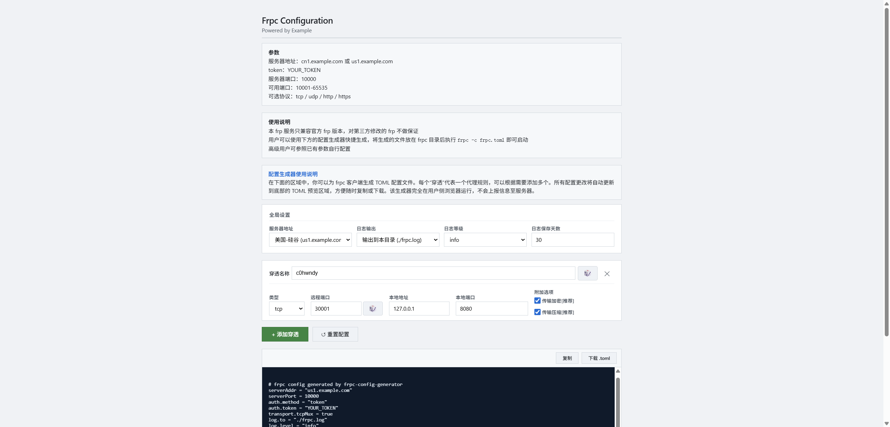

# Kokona-frpc-c

纯前端的 frpc 配置生成器。填写表单后自动生成 `frpc.toml`，支持复制与下载。

> 不兼容非官方版本的frp
> token等信息会直接明文暴露，建议用作公益站，或者在 Web服务器 侧添加访问密码



## 小巧思

- 支持禁用 `tcp` / `udp` / `http` / `https` 中任意一种协议
- 随机端口、随机名称，一键重置
- 实时 TOML 预览，复制与下载

## 快速开始

1. 下载或克隆本仓库
2. 把 `index.html`、`config.example.json`、`favicon.png`放到静态服务器同一目录
3. 复制 `config.example.json` 为 `config.json`，改成你自己的服务器信息
4. 在你常用的 Web服务器 搭建

> 页面优先读取 `config.json`，不存在则回退到 `config.example.json`。两者都不存在时，页面会直接报错。

## 配置说明

### 顶层字段

| 字段 | 类型 | 说明 |
| --- | --- | --- |
| `meta` | object | 页面标题、副标题、页脚提示 |
| `notice` | object | 页面上三段说明文字，允许内嵌 HTML |
| `server` | object | frp 服务端信息与服务器下拉选项 |
| `ports` | object | 远程 / 本地端口取值范围 |
| `proxyTypes` | array | 开放哪些协议，可选 `tcp` / `udp` / `http` / `https` |
| `advanced` | object | 是否开放 HTTP/HTTPS 高级字段 |
| `log` | object | 日志输出方式、等级、保存天数 |
| `defaults` | object | 默认穿透数量、本地地址、随机名称字符集、示例规则 |

### `meta`

```json
{
  "meta": {
    "title": "Frpc Configuration",
    "subtitle": "Powered by Example",
    "footerTip": "贵安"
  }
}
```

### `notice`

三个字段都允许写 HTML，页面用 `innerHTML` 插入。内容由站点维护者提供，不来自访客输入。

```json
{
  "notice": {
    "params": "<strong>参数</strong><br>服务器地址：...<br>token：...",
    "usage":  "<strong>使用说明</strong><br>...",
    "intro":  "<strong>配置生成器使用说明</strong><br>..."
  }
}
```

### `server`

```json
{
  "server": {
    "port": 10000,
    "token": "YOUR_TOKEN",
    "tcpMux": true,
    "disablePrintColor": false,
    "options": [
      { "value": "cn1.example.com", "label": "中国-深圳 (cn1.example.com)" },
      { "value": "us1.example.com", "label": "美国-硅谷 (us1.example.com)" }
    ]
  }
}
```

| 字段 | 说明 |
| --- | --- |
| `port` | frps 服务端口，写入 `serverPort` |
| `token` | 鉴权 token，写入 `auth.token` |
| `tcpMux` | 写入 `transport.tcpMux` |
| `disablePrintColor` | 写入 `log.disablePrintColor`，仅在启用日志时输出 |
| `options` | 服务器下拉选项，`value` 为地址，`label` 为显示文字 |

### `ports`

```json
{
  "ports": {
    "remote": { "min": 10001, "max": 65535 },
    "local":  { "min": 1024,  "max": 65535 }
  }
}
```

### `proxyTypes`

控制协议下拉中出现哪些选项。默认 `["tcp", "udp"]`。

```json
{ "proxyTypes": ["tcp", "udp"] }
```

想开放 HTTP/HTTPS：

```json
{ "proxyTypes": ["tcp", "udp", "http", "https"] }
```

### `advanced`

控制 HTTP/HTTPS 高级字段是否显示。默认全部 `false`。

```json
{
  "advanced": {
    "locations": false,
    "httpAuth": false,
    "subdomain": false
  }
}
```

| 字段 | 作用 | 适用协议 |
| --- | --- | --- |
| `locations` | 显示“URL 路由”输入框，对应 `locations` | `http` / `https` |
| `httpAuth` | 显示“HTTP 用户名 / 密码”，对应 `http_user` / `http_pwd` | 仅 `http` |
| `subdomain` | 显示“子域名”输入框，对应 `subdomain` | `http` / `https` |

> `https` 不显示 `http_user` / `http_pwd`，因为官方 frps 对 `https` 类型不做 TLS 终止，不支持 Basic Auth。

### `log`

```json
{
  "log": {
    "outputOptions": [
      { "value": "none",  "label": "不输出日志" },
      { "value": "local", "label": "输出到本目录 (./frpc.log)" }
    ],
    "levelOptions": ["info", "debug", "warn", "error"],
    "defaultOutput": "local",
    "defaultLevel": "info",
    "defaultMaxDays": 30,
    "maxDaysMin": 1,
    "maxDaysMax": 365
  }
}
```

选择“不输出日志”时，生成的 TOML **不会包含任何 `log.*` 字段**，UI 也会隐藏“日志等级”和“保存天数”两个输入框。

### `defaults`

```json
{
  "defaults": {
    "proxyCount": 2,
    "localAddr": "127.0.0.1",
    "encryption": true,
    "compression": true,
    "name": {
      "chars": "abcdefghijklmnopqrstuvwxyz0123456789",
      "minLength": 6,
      "maxLength": 10
    },
    "examples": [
      { "type": "tcp", "remotePort": 30001, "localPort": 8080, "localAddr": "127.0.0.1" },
      { "type": "udp", "remotePort": null,  "localPort": null, "localAddr": "10.0.0.1" }
    ]
  }
}
```

`examples` 里可以给每种协议写不同示例。`http` / `https` 用 `customDomains`（数组或逗号分隔字符串），还可以带 `locations`、`subdomain`、`httpUser`、`httpPwd`。

## 生成的 TOML 示例

### TCP

```toml
[[proxies]]
name = "tcp-rule"
type = "tcp"
localIP = "127.0.0.1"
localPort = 8080
remotePort = 30001

[proxies.transport]
useEncryption = true
useCompression = true
```

### HTTP

```toml
[[proxies]]
name = "web"
type = "http"
localIP = "127.0.0.1"
localPort = 8000
customDomains = ["web.example.com"]
locations = ["/", "/api"]
http_user = "admin"
http_pwd = "pass"

[proxies.transport]
useEncryption = true
useCompression = true
```

### HTTPS

```toml
[[proxies]]
name = "secure"
type = "https"
localIP = "127.0.0.1"
localPort = 8443
customDomains = ["secure.example.com"]
locations = ["/"]

[proxies.transport]
useEncryption = true
useCompression = true
```

## 未支持的功能

以下字段**不是**官方 frpc 的配置项，本生成器不提供，也不会生成：

- WOL 开机隧道（`SakuraFrp` 等平台的魔改版 frpc 才有）
- HTTP 重定向
- 自动 HTTPS
- 平台自定义的“隧道自定义设置”

如果你用的是官方 frpc，这些字段写进 `frpc.toml` 会直接报错。如果你用的是某个第三方修改版，请以该版本的文档为准，本工具不保证兼容。

## License

[MIT](./LICENSE)